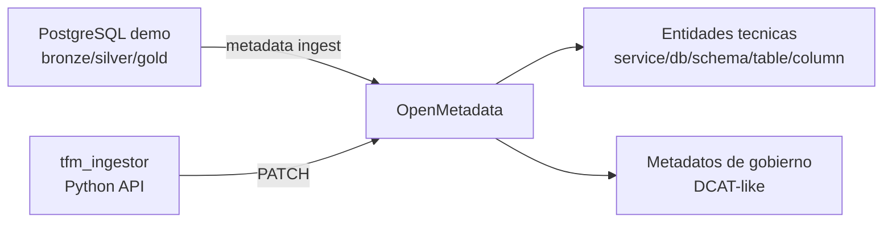

# TFM - OpenMetadata + DCAT-AP-ES (PoC reproducible)

Repositorio del Trabajo Fin de Master:

- Titulo (ES): Diseno y configuracion de un modelo de metadatos en OpenMetadata conforme al estandar DCAT-AP para la interoperabilidad de catalogos de datos.
- Titulo (EN): Design and Configuration of a Metadata Model in OpenMetadata According to the DCAT-AP Standard for Data Catalog Interoperability.

## Que demuestra este proyecto (portfolio)

- Despliegue reproducible de una plataforma de catalogo de datos con Kubernetes + Helm.
- Modelado de gobierno de datos alineado con DCAT-AP-ES sobre OpenMetadata.
- Automatizacion de metadatos por API REST (Python), con enfoque idempotente.
- Calidad tecnica minima exigible: configuracion declarativa, scripts operativos y tests de reglas.

En resumen: una PoC pequena pero realista, pensada para ejecutar hoy en local y escalar despues a VPS/cloud.

## Alcance MVP (6 ECTS)

Incluye:
- OpenMetadata en Kubernetes local.
- PostgreSQL dummy con capas `bronze/silver/gold`.
- Ingesta tecnica oficial (Service/Database/Schemas/Tables/Columns).
- Enriquecimiento de gobierno (tags + custom properties + domains) via `tfm_ingestor`.

No incluye (trabajo futuro):
- HA, hardening, SSO/LDAP, RBAC avanzado, backup, escalado, observabilidad avanzada.

## Idea clave del TFM

OpenMetadata no ingesta DCAT-AP-ES "nativo" como conector completo.
En esta PoC, DCAT se representa mediante:
- metamodelo OpenMetadata,
- custom properties,
- tags/domains/owners.

## Arquitectura (alto nivel)



Mas diagramas Mermaid para memoria y anexos:
- `docs/diagramas_mermaid.md`

## Ejecucion rapida

Desde la raiz del repo:

```powershell
powershell -ExecutionPolicy Bypass -File .\scripts\infra\run_full_flow.ps1
```

Este comando ejecuta, en orden:
1. despliegue `postgres-demo` dentro de Kubernetes
2. despliegue OpenMetadata en Kubernetes
3. conexion + ingesta tecnica de PostgreSQL
4. bootstrap de tags/custom properties
5. `python -m tfm_ingestor --dry-run`

Guia unica recomendada para no dispersarse:
- `docs/guia_centralizada.md`

## Estructura del repositorio

- `docs/`: documentacion tecnica y anexos de instalacion.
- `k8s/`: values Helm para despliegue local.
- `scripts/infra/`: scripts de operacion (infra, ingest, governance, dry-run).
- `sql/`: esquema + datos dummy de PostgreSQL.
- `tfm_ingestor/`: modulo Python de enriquecimiento y tests.

## Seguridad y privacidad del repo

Carpetas locales no publicables se mantienen fuera del control de versiones.

Verificacion rapida:
```powershell
git status --ignored --short
```

## Documentacion principal

- `docs/guia_centralizada.md`
- `docs/README.md`
- `docs/anexos_instalacion/README.md`
- `docs/openmetadata_k8s.md`
- `docs/ingesta_tecnica_postgres.md`
- `docs/tfm_ingestor.md`
