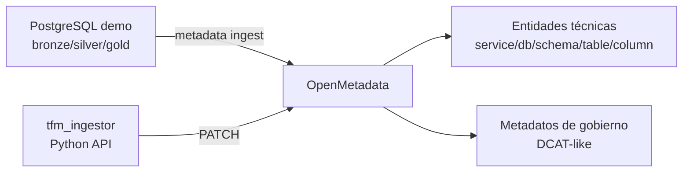

# TFM - OpenMetadata + DCAT-AP (perfil DCAT-AP-ES) 

Repositorio del Trabajo Fin de Master:

- Titulo (ES): Diseño y configuración de un modelo de metadatos en OpenMetadata conforme al estándar DCAT-AP para la interoperabilidad de catálogos de datos.
- Titulo (EN): Design and Configuration of a Metadata Model in OpenMetadata According to the DCAT-AP Standard for Data Catalog Interoperability.

## Que demuestra este proyecto

- Despliegue reproducible de una plataforma de catálogo de datos con Kubernetes + Helm.
- Modelado de gobierno de datos alineado con DCAT-AP (usando DCAT-AP-ES como perfil concreto en la PoC) sobre OpenMetadata.
- Automatización de metadatos por API REST (Python), con enfoque idempotente.
- Calidad técnica mínima exigible: configuración declarativa, scripts operativos y tests de reglas.

En resumen: una PoC pequeña pero realista, pensada para ejecutar hoy en local y escalar después a VPS/cloud.

## Alcance MVP (6 ECTS)

Incluye:
- OpenMetadata en Kubernetes local.
- PostgreSQL dummy con capas `bronze/silver/gold`.
- Ingesta técnica oficial (Service/Database/Schemas/Tables/Columns).
- Enriquecimiento de gobierno (tags + custom properties + domains) vía `tfm_ingestor`.

No incluye (trabajo futuro):
- HA, hardening, SSO/LDAP, RBAC avanzado, backup, escalado, observabilidad avanzada.

## Idea clave del TFM

OpenMetadata no ingesta DCAT-AP "nativo" como conector completo (y lo mismo aplica a perfiles como DCAT-AP-ES).
En esta PoC, DCAT se representa mediante:
- metamodelo OpenMetadata,
- custom properties,
- tags/domains/owners.

## Arquitectura (alto nivel)


```mermaid
flowchart LR
  A[PostgreSQL demo<br/>bronze/silver/gold] -->|metadata ingest| B[OpenMetadata]
  B --> C[Entidades técnicas<br/>service/db/schema/table/column]
  D[tfm_ingestor<br/>Python API] -->|PATCH| B
  B --> E[Metadatos de gobierno<br/>DCAT-like]
```

Más diagramas Mermaid para memoria y anexos:
- `docs/diagramas_mermaid.md`

## Ejecución rapida

Desde la raiz del repo:

```powershell
powershell -ExecutionPolicy Bypass -File .\scripts\infra\run_full_flow.ps1
```

Este comando ejecuta, en orden:
1. despliegue `postgres-demo` dentro de Kubernetes
2. despliegue OpenMetadata en Kubernetes
3. conexión + ingesta técnica de PostgreSQL
4. bootstrap de tags/custom properties
5. `python -m tfm_ingestor --dry-run`

Guia ?nica recomendada para no dispersarse:
- `docs/guia_centralizada.md`

## Estructura del repositorio

- `docs/`: documentación técnica y anexos de instalacion.
- `k8s/`: values Helm para despliegue local.
- `scripts/infra/`: scripts de operación (infra, ingest, governance, dry-run).
- `sql/`: esquema + datos dummy de PostgreSQL.
- `tfm_ingestor/`: modulo Python de enriquecimiento y tests.

## Seguridad y privacidad del repo

Carpetas locales no publicables se mantienen fuera del control de versiones.

Verificacion rapida:
```powershell
git status --ignored --short
```

## Documentación principal

- `docs/guia_centralizada.md`
- `docs/tfm_oficial_objetivos_decisiones.md`
- `docs/README.md`
- `docs/anexos_instalacion/README.md`
- `docs/openmetadata_k8s.md`
- `docs/ingesta_tecnica_postgres.md`
- `docs/tfm_ingestor.md`
- `docs/github_projects_mvp.md`
