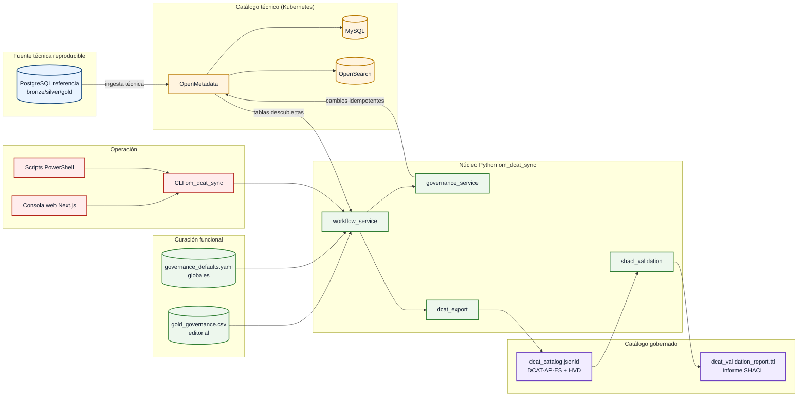
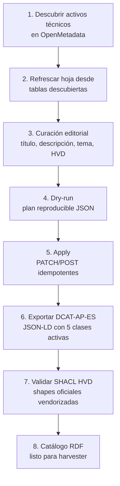
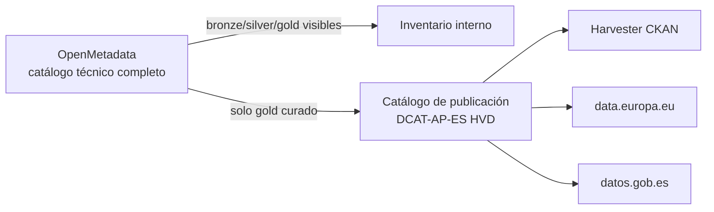

# Plataforma de Gobierno del Dato · OpenMetadata + DCAT-AP-ES (TFM UCLM 2026)

> Trabajo Fin de Máster del *Máster Universitario en Big Data y Computación en la Nube* (UCLM). Plataforma **end-to-end** que toma activos técnicos descubiertos en **OpenMetadata** sobre **Kubernetes**, los gobierna desde una hoja funcional versionable, exporta el catálogo en **DCAT-AP-ES (JSON-LD)** y lo **valida con SHACL** contra el perfil oficial **HVD** del Gobierno de España. La salida es un archivo RDF listo para federarse en `datos.gob.es`, `data.europa.eu` o cualquier portal CKAN compatible.


---

## Tabla de contenidos

1. [Contexto y objetivo](#1-contexto-y-objetivo)
2. [Recorrido visual end-to-end](#2-recorrido-visual-end-to-end)
3. [Arquitectura](#3-arquitectura)
4. [Stack tecnológico](#4-stack-tecnológico)
5. [Características clave](#5-características-clave)
6. [Resultados medidos](#6-resultados-medidos)
7. [Estructura del repositorio](#7-estructura-del-repositorio)
8. [Puesta en marcha](#8-puesta-en-marcha)
9. [Uso del sistema](#9-uso-del-sistema)
10. [CLI canónico](#10-cli-canónico)
11. [Modelo de datos DCAT-AP-ES activo](#11-modelo-de-datos-dcat-ap-es-activo)
12. [Limitaciones y trabajo futuro](#12-limitaciones-y-trabajo-futuro)
13. [Documentación técnica completa](#13-documentación-técnica-completa)
14. [Autor](#14-autor)

---

## 1. Contexto y objetivo

Trabajo Fin de Máster (curso 2025-2026) del **Máster Universitario en Big Data y Computación en la Nube** de la **UCLM**, en la Escuela Superior de Ingeniería Informática de Albacete (ESII) y la Escuela Superior de Informática de Ciudad Real (ESI).

- **Título oficial (ES):** *Diseño y configuración de un modelo de metadatos en OpenMetadata conforme al estándar DCAT-AP para la interoperabilidad de catálogos de datos*.
- **Título oficial (EN):** *Design and Configuration of a Metadata Model in OpenMetadata According to the DCAT-AP Standard for Data Catalog Interoperability*.
- **Concreción operativa:** `DCAT-AP-ES 1.0.0` (DCAT-AP 2.1.1 + DCAT-AP HVD 2.2.0).

**Problema abordado.** Las organizaciones suelen tener un catálogo técnico maduro (OpenMetadata, DataHub, Amundsen…) y, separado, un proceso editorial para publicar abierto en portales DCAT-AP. Ese hueco es manual, dataset por dataset, y se rompe en cuanto cambia el inventario técnico. Este TFM construye la capa que **cierra la grieta**: gobierno centralizado, idempotente y validado formalmente entre el catálogo técnico y el archivo RDF que aceptan los portales europeos.

**Aportación demostrable.** Un flujo completo, reproducible desde un repositorio limpio, que descubre activos técnicos en OpenMetadata, los enriquece con metadatos editoriales desde una hoja CSV versionada, los sincroniza de forma idempotente, exporta JSON-LD conforme a DCAT-AP-ES HVD, y produce un informe SHACL Turtle con cero violaciones bloqueantes.

---

## 2. Recorrido visual end-to-end

La consola web (`web/`, Next.js + pnpm) materializa el flujo en nueve pantallas que un operario recorre sin tocar línea de comandos. El recorrido completo, paso a paso, con artefactos producidos en cada etapa, está documentado en el **Anexo F de la memoria** (`TFM/Memoria/appendices/apendice_demo_operativa.tex`).

| Etapa | Pantalla web | Acción | Artefacto producido |
|---:|---|---|---|
| 1 | Infraestructura | Comprobar pods de Kubernetes y servicios | Estado del clúster |
| 2 | Ingesta | Verificar los dos `DatabaseService` de OpenMetadata | Tablas `gold` descubiertas |
| 3 | Gobierno | Refrescar hoja, editar metadatos DCAT-AP-ES, validar y guardar | `gold_governance.csv` |
| 4 | Workflow → Dry-run | Previsualizar plan en JSON | Plan reproducible |
| 5 | Workflow → Apply | Sincronizar OpenMetadata | Cambios aplicados (0 en la 2ª pasada → idempotencia) |
| 6 | DCAT | Exportar catálogo | `dcat_catalog.jsonld` |
| 7 | Validación | Lanzar suite reproducible | `validation_suite_summary.json` |
| 8 | SHACL | Revisar violaciones por severidad | `dcat_validation_report.ttl` |
| 9 | Artefactos | Descargar el RDF final para federar | Catálogo entregable |

---

## 3. Arquitectura


```mermaid
flowchart LR
    classDef src fill:#e8f3ff,stroke:#174a7c,stroke-width:2px,color:#162033
    classDef k8s fill:#fff4df,stroke:#b87900,stroke-width:2px,color:#162033
    classDef core fill:#edf7ed,stroke:#2f7d32,stroke-width:2px,color:#162033
    classDef out fill:#f1ecff,stroke:#6f42c1,stroke-width:2px,color:#162033
    classDef ops fill:#ffecec,stroke:#b42318,stroke-width:2px,color:#162033

    subgraph SRC["Fuente técnica reproducible"]
        PG[(PostgreSQL referencia<br/>bronze/silver/gold)]:::src
    end

    subgraph META["Catálogo técnico (Kubernetes)"]
        OM[OpenMetadata]:::k8s
        MY[(MySQL)]:::k8s
        OS[(OpenSearch)]:::k8s
    end

    subgraph FUNC["Curación funcional"]
        SHEET[(gold_governance.csv<br/>editorial)]:::core
        CFG[(governance_defaults.yaml<br/>globales)]:::core
    end

    subgraph CORE["Núcleo Python om_dcat_sync"]
        WF[workflow_service]:::core
        GOV[governance_service]:::core
        EXP[dcat_export]:::core
        VAL[shacl_validation]:::core
    end

    subgraph OUT["Catálogo gobernado"]
        JSONLD[dcat_catalog.jsonld<br/>DCAT-AP-ES + HVD]:::out
        TTL[dcat_validation_report.ttl<br/>informe SHACL]:::out
    end

    subgraph OPS["Operación"]
        WEB[Consola web Next.js]:::ops
        CLI[CLI om_dcat_sync]:::ops
        PS[Scripts PowerShell]:::ops
    end

    PG -->|ingesta técnica| OM
    OM --> MY
    OM --> OS
    OM -->|tablas descubiertas| WF
    SHEET --> WF
    CFG --> WF
    WF --> GOV
    GOV -->|cambios idempotentes| OM
    WF --> EXP --> JSONLD
    JSONLD --> VAL --> TTL
    WEB --> CLI
    PS --> CLI
    CLI --> WF
```

### Flujo de gobierno


```mermaid
flowchart TB
    A[1. Descubrir activos técnicos<br/>en OpenMetadata] --> B[2. Refrescar hoja desde<br/>tablas descubiertas]
    B --> C[3. Curación editorial<br/>título, descripción, tema, HVD]
    C --> D[4. Dry-run<br/>plan reproducible JSON]
    D --> E[5. Apply<br/>PATCH/POST idempotentes]
    E --> F[6. Exportar DCAT-AP-ES<br/>JSON-LD con 5 clases activas]
    F --> G[7. Validar SHACL HVD<br/>shapes oficiales vendorizadas]
    G --> H[8. Catálogo RDF<br/>listo para harvester]
```

### Estado vs publicación


```mermaid
flowchart LR
    OM[OpenMetadata<br/>catálogo técnico completo] -->|bronze/silver/gold visibles| INV[Inventario interno]
    OM -->|solo gold curado| PUB[Catálogo de publicación<br/>DCAT-AP-ES HVD]
    PUB --> CKAN[Harvester CKAN]
    PUB --> EU[data.europa.eu]
    PUB --> ES[datos.gob.es]
```

Decisión documentada: solo la capa `gold` entra en el catálogo de publicación. La justificación completa (conformidad semántica, alineación DAMA, separación catálogo técnico/publicación) está en el capítulo de Resultados de la memoria, dentro de la arquitectura de la solución (decisión de gobierno restringido a la capa `gold`).

---

## 4. Stack tecnológico

| Capa | Tecnología | Razón |
|---|---|---|
| Fuente técnica | **PostgreSQL 16** | Reproducible, expresivo, ampliamente extendido en organizaciones reales |
| Catálogo de metadatos | **OpenMetadata 1.11** | API REST, modelo de entidades maduro, custom properties extensibles |
| Orquestación contenedores | **Kubernetes + Helm + Kind** | Despliegue declarativo, idempotente, transferible |
| Núcleo de gobierno | **Python 3.11 + rdflib + pySHACL** | Tipado moderno, dataclasses inmutables, validación SHACL nativa |
| Consola operativa | **Next.js 16 + React 19 + TypeScript** | Server actions, UI sobre lógica cerrada del núcleo |
| Gestor de paquetes Node | **pnpm** (canónico) | Velocidad, lockfile estricto, store global |
| Perfil semántico | **DCAT-AP-ES 1.0.0 + HVD** | Estándar español oficial alineado con la práctica europea |
| Validación | **SHACL** (W3C) con shapes oficiales vendorizadas | Garantía formal del cumplimiento del perfil |
| Bibliografía y memoria | **LaTeX + XeLaTeX + BibTeX** | Calidad académica, control total tipográfico |
| Pruebas backend | **pytest** | Fixtures reutilizables, cobertura del núcleo Python |
| Pruebas frontend | **vitest** | Test runner moderno integrado con Vite/Next |

---

## 5. Características clave

- **Idempotencia comprobable**: una segunda ejecución consecutiva del workflow aplica `0` cambios. Esta propiedad se demuestra empíricamente en la suite reproducible (`scripts/infra/run_validation_suite.ps1`).
- **Validación formal contra perfil oficial**: el catálogo se valida con las shapes SHACL oficiales del Gobierno de España, vendorizadas en `tfm_ingestor/src/tfm_ingestor/resources/shacl/` desde el commit `f2c8a888` de `datosgobes/DCAT-AP-ES`. Sin dependencias de red en validación.
- **Núcleo único, consumidores múltiples**: el CLI `om_dcat_sync`, los scripts PowerShell y la consola web Next.js invocan exactamente la misma lógica de negocio Python. La consola no reimplementa reglas — es un cliente cerrado.
- **Gobierno declarativo**: una hoja `gold_governance.csv` versionable + un YAML de defaults globales sustituyen la edición dataset por dataset que ofrecen las alternativas comerciales.
- **Reproducibilidad total**: el flujo completo (despliegue Kubernetes + ingesta doble + workflow + validación) corre desde repositorio limpio sin servicios externos cloud propietarios.
- **Doble ingesta multi-fuente**: dos `DatabaseService` sobre el mismo PostgreSQL demuestran que el gobierno opera sobre `FQN`, no sobre nombres cortos.
- **Artefactos versionables**: todo el resultado (JSON-LD, Turtle, JSON) se genera en `tmp_pytest/` y es regenerable bit a bit entre ejecuciones.
- **Operador no técnico soportado**: la consola web ejecuta cada etapa con un botón, persiste jobs y artefactos, y muestra historial sin requerir conocimiento de PowerShell o Python.

---

## 6. Resultados medidos

| Métrica | Valor | Verificación |
|---|---|---|
| Idempotencia del workflow | **0 cambios en 2ª pasada** | `validation_suite_summary.json` |
| Datasets publicables generados | **4** (2 servicios × 2 tablas `gold`) | `dcat_catalog.jsonld` |
| Violaciones SHACL bloqueantes | **0** (warnings permitidos) | `dcat_validation_report.ttl` |
| Tiempo de despliegue completo (infra + ingesta + workflow) | **~5 min** desde repo limpio | `run_full_flow.ps1` |
| Cobertura del perfil DCAT-AP-ES HVD | **5 clases activas** (`Catalog`, `Dataset`, `Distribution`, `DataService`, `Agent`) | `dcat_export.py` |
| Conformidad runtime OpenMetadata ↔ SQL referencia | **conforme** | `runtime_validation_report.json` |
| Tests Python | **pytest verde** | `python -m pytest` |
| Tests web | **vitest verde** | `pnpm test` |

---

## 7. Estructura del repositorio

```text
TFM_Alonso_Marcos_Muñoz/
├── README.md                            ← este documento
├── docs/                                ← decisiones, mapeos y guías
│   ├── tfm_oficial_objetivos_decisiones.md
│   ├── dcat_mapping.md
│   ├── guia_centralizada.md
│   └── app_web.md
├── tfm_ingestor/                        ← núcleo Python (om_dcat_sync)
│   ├── src/tfm_ingestor/
│   │   ├── workflow_service.py          ← orquestador canónico
│   │   ├── governance_service.py        ← sincronización idempotente
│   │   ├── dcat_export.py               ← exportador DCAT-AP-ES
│   │   ├── shacl_validation.py          ← validador con pySHACL
│   │   └── resources/shacl/             ← shapes oficiales vendorizadas
│   ├── config/
│   │   ├── gold_governance.csv          ← hoja editorial canónica
│   │   ├── governance_defaults.yaml     ← defaults globales
│   │   └── operational_profile.yaml     ← perfil de ejecución
│   └── tests/                           ← suite pytest
├── web/                                 ← consola operativa Next.js
│   ├── src/app/                         ← pantallas por etapa
│   └── package.json
├── scripts/
│   ├── infra/                           ← despliegue, ingesta, suite reproducible
│   ├── quality/                         ← chequeos pre-push y render Mermaid
│   └── planning/                        ← automatización del Project GitHub
├── k8s/                                 ← valores Helm de OpenMetadata
├── sql/                                 ← PostgreSQL de referencia
├── TFM/Memoria/                         ← memoria LaTeX + figuras + bibliografía
└── tmp_pytest/                          ← artefactos regenerables (no versionado)
```

---

## 8. Puesta en marcha

### 8.1 Requisitos

- Windows 10/11 con PowerShell, Docker Desktop activo.
- **Node.js 20+** con **pnpm** activado por corepack (gestor canónico — no usar npm en comandos nuevos).
- **Python 3.11+**.
- **MiKTeX** (solo si se quiere compilar la memoria localmente).
- **kubectl**, **helm** y **kind** en `PATH`.

### 8.2 Instalación

```powershell
python -m pip install -r requirements-dev.txt
cd .\web; pnpm install; cd ..
```

### 8.3 Despliegue (en orden)

```powershell
powershell -ExecutionPolicy Bypass -File .\scripts\infra\launch_infra.ps1
powershell -ExecutionPolicy Bypass -File .\scripts\infra\ingest_postgres_double.ps1
python .\scripts\infra\bootstrap_governance.py
```

### 8.4 Operación desde la consola web (recomendado)

```powershell
cd .\web
pnpm dev
```

Abrir `http://localhost:3000` y recorrer las pantallas en orden: *Infraestructura → Ingesta → Gobierno → Workflow → DCAT → Validación → SHACL → Artefactos*. El recorrido completo está descrito paso a paso en el Anexo F de la memoria.

### 8.5 Operación desde CLI (alternativa)

```powershell
python -m om_dcat_sync workflow run --dry-run        # plan reproducible
python -m om_dcat_sync workflow run --allow-warnings # apply + export + validate
```

### 8.6 Suite reproducible

```powershell
powershell -ExecutionPolicy Bypass -File .\scripts\infra\run_validation_suite.ps1
```

Deja artefactos en `tmp_pytest/`: `runtime_validation_report.json`, `validation_suite_summary.json`, `validation_suite_catalog.jsonld`, `validation_suite_shacl_report.ttl`, `pre_push_checks.json`.

---

## 9. Uso del sistema

### Como operario de gobierno (consola web)

Refrescar la hoja desde OpenMetadata → editar campos editoriales (título, descripción, publicador, temática NTI-RISP, categoría HVD, URL de distribución) → validar → guardar → dry-run → apply → exportar → validar SHACL → descargar el JSON-LD final.

### Como integrador (federar el catálogo)

El archivo `dcat_catalog.jsonld` es RDF válido DCAT-AP-ES 1.0.0 + HVD, comprobado por SHACL. Se entrega a:

- Un harvester **CKAN** con extensión `ckanext-dcat` vía `/dataset/import`.
- El equipo de federación de **datos.gob.es** como entrada del proceso editorial.
- Un triplestore (**Apache Jena Fuseki**) para consultas SPARQL.
- **rdflib** en Python para análisis programático.

Ejemplo de entrega vía curl:

```powershell
curl -X POST https://harvester.example.org/api/dataset/import `
     -H "Authorization: Bearer $TOKEN" `
     -H "Content-Type: application/ld+json" `
     --data-binary "@tmp_pytest/dcat_catalog.jsonld"
```

---

## 10. CLI canónico

| Comando | Uso |
|---|---|
| `python -m om_dcat_sync workflow run --dry-run` | Plan reproducible sin aplicar cambios |
| `python -m om_dcat_sync workflow run --allow-warnings` | Aplica gobierno + exporta + valida SHACL |
| `python -m om_dcat_sync generate-governance-sheet` | Regenera la hoja desde OpenMetadata sin curar |
| `python -m om_dcat_sync export-dcat --output dcat_catalog.jsonld` | Exporta el catálogo de forma aislada |
| `python -m om_dcat_sync validate-dcat --profile-case hvd --allow-warnings` | Valida SHACL aislado contra el bundle HVD |
| `python -m om_dcat_sync validate-runtime --strict` | Compara el estado vivo de OpenMetadata con el SQL fuente |

---

## 11. Modelo de datos DCAT-AP-ES activo

**Clases**: `dcat:Catalog`, `dcat:Dataset`, `dcat:Distribution`, `dcat:DataService`, `foaf:Agent`.

**Metadatos curados en OpenMetadata** (custom properties + tags):

| Campo | Origen | Mapeo DCAT-AP-ES |
|---|---|---|
| `displayName` | OpenMetadata | `dct:title` |
| `description` | OpenMetadata | `dct:description` |
| `dcat_publisher_name` | custom property | `dct:publisher` → `foaf:Agent` |
| `dcat_hvd_category` | custom property | `dcatap:hvdCategory` |
| `dcat_access_url` | custom property | `dcat:accessURL` |
| `dcat_theme.*` | tag | `dcat:theme` (NTI-RISP) |

**Metadatos derivados por configuración** (`governance_defaults.yaml`):

`dcatap:applicableLegislation` (Reglamento UE 2023/138 HVD), `dct:license`, `dct:accessRights`, `dcat:endpointURL`, `dcat:endpointDescription`, `foaf:page`, `dcat:contactPoint`, `dcat:servesDataset`.

Esta separación es deliberada: lo que varía dataset por dataset se cura en la hoja; lo que aplica al catálogo entero vive en YAML para evitar duplicación y errores de consistencia.

---

## 12. Limitaciones y trabajo futuro

- **Datos sintéticos**: el caso de uso valida la plataforma cloud, no la calidad del dato de negocio.
- **Sin publicación automática**: la plataforma deja el JSON-LD listo para federar, pero la entrega a `datos.gob.es` o CKAN se documenta como paso siguiente (no hay credenciales reales contra esos portales en el alcance).
- **HVD como hipótesis de diseño**: la calificación HVD se usa para ejercitar el perfil más exigente del estándar; no es una calificación jurídica automática para datasets reales.
- **Sin RBAC/SSO/HA**: el alcance no incluye alta disponibilidad, hardening corporativo ni control de acceso granular; corresponden a programas de plataforma con presupuesto y ciclo de vida diferentes.
- **CKAN como flujo operativo activo**: descartado en favor de PostgreSQL como fuente canónica, porque cosechar un catálogo externo replicaría metadatos ya publicados y no demostraría gobierno desde sistemas fuente. CKAN se mantiene como destino federable, no como origen.

Detalle completo en el capítulo de Resultados (sección «Discusión de los resultados») y en Conclusiones y trabajos futuros de la memoria técnica.

---

## 13. Documentación técnica completa

La memoria técnica (PDF compilado con XeLaTeX) sigue la estructura normativa del MUBDCN en seis capítulos:

| Capítulo | Contenido |
|---|---|
| 01 | Introducción: contexto DCAT-AP-ES, problema, aportación, alcance y exclusiones |
| 02 | Objetivos |
| 03 | Estado del arte (RDF, JSON-LD, DCAT-AP-ES, SHACL, gobierno del dato, OpenMetadata, mercado de herramientas) |
| 04 | Metodología de trabajo (Kanban/PMBOK, tablero GitHub Projects, fases del roadmap, stack tecnológico y organización del repositorio) |
| 05 | Resultados: arquitectura (con actores y requisitos), implementación (PostgreSQL, Kubernetes, núcleo Python, exportador DCAT, validador SHACL, consola web), validación con métricas reproducibles, discusión y trazabilidad |
| 06 | Conclusiones y trabajos futuros |
| A | Reproducción del caso de uso de validación |
| B | Detalle de infraestructura |
| C | Esquema de gobierno funcional (hoja de gobierno) |
| D | Mapeo DCAT-AP-ES y entregables |
| E | Validación y consola web |
| F | **Demostración guiada de la plataforma** (recorrido visual end-to-end paso a paso) |
| G | Capturas y listados complementarios |
| H | Posicionamiento Big Data y gobierno supervisado |

> Archivo: [`TFM/Memoria/TFM.pdf`](TFM/Memoria/TFM.pdf) (compilable con `xelatex TFM.tex; bibtex TFM; xelatex TFM.tex; xelatex TFM.tex`).

Documentación operativa complementaria en [`docs/`](docs/): mapeo DCAT-AP-ES, guía centralizada del flujo, estructura del repositorio, app web, diagramas Mermaid canónicos.

---

## 14. Autor

**Alonso Marcos Muñoz** — alonso.marcos@alu.uclm.es
*Máster Universitario en Big Data y Computación en la Nube* — Universidad de Castilla-La Mancha (UCLM).
Trabajo Fin de Máster (TFM), curso 2025-2026. Defensa prevista: junio de 2026.

- **Tutor:** Fernando Gualo Cejudo.
- **Codirector:** Antonio Labian Moya.

---

> Proyecto académico. Toda la infraestructura corre localmente sobre Docker + Kind; el bundle SHACL está vendorizado para garantizar reproducibilidad determinista. Las shapes oficiales pertenecen al Gobierno de España (`datosgobes/DCAT-AP-ES`).
