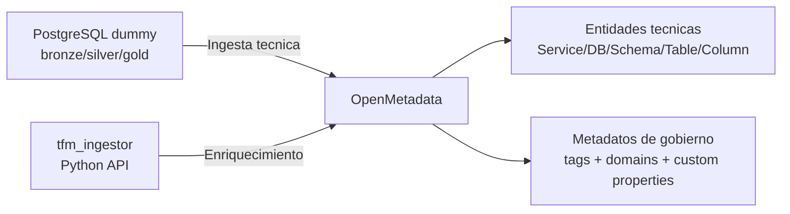
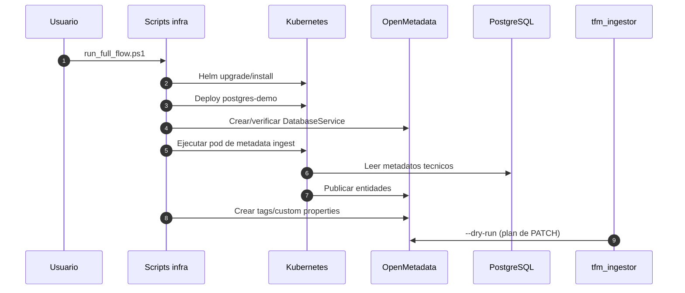
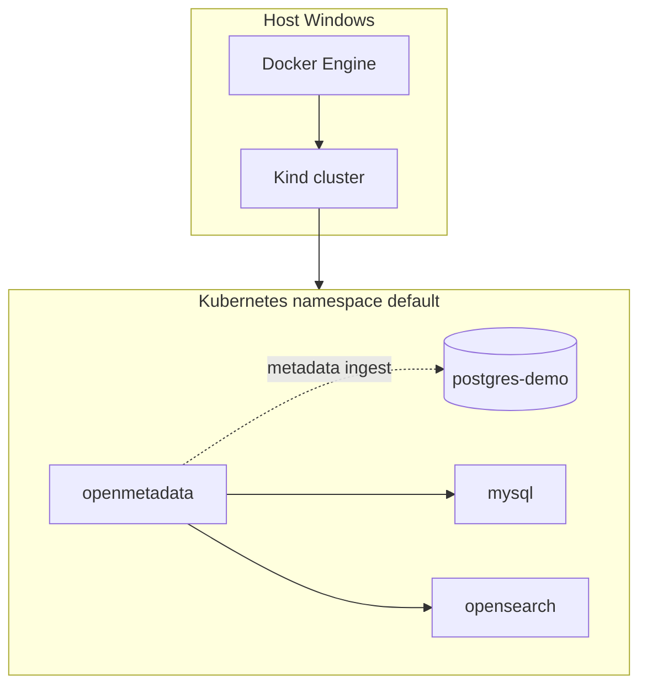
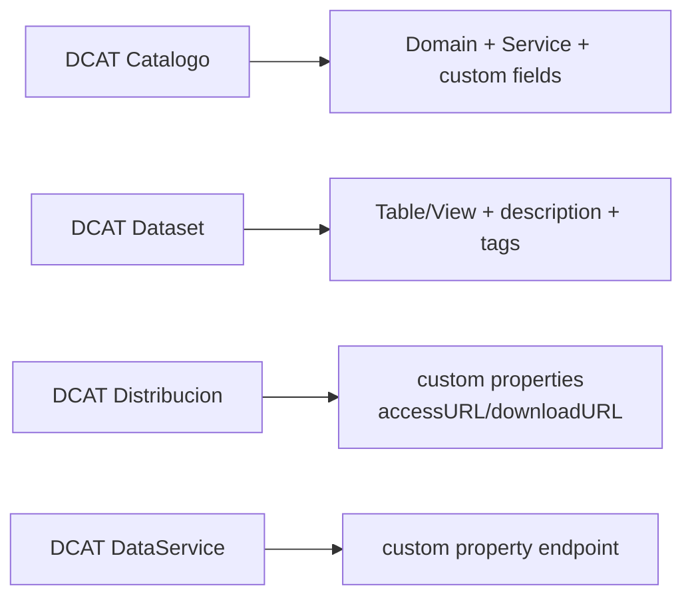

# Diagramas Mermaid (memoria y portfolio)

Este documento centraliza diagramas Mermaid reutilizables en:
- README del repositorio
- anexos de memoria
- presentacion/defensa

## 1) Arquitectura general de la PoC

## 2) Flujo operativo de extremo a extremo

## 3) Stack de despliegue (local reproducible)

## 4) Mapeo simplificado DCAT-AP-ES -> OpenMetadata

## Nota para memoria en LaTeX

LaTeX no renderiza Mermaid de forma nativa. Recomendacion:
1) mantener estos bloques como fuente documental,
2) exportar a SVG/PNG con `mmdc` para insertar en `main.tex`.
