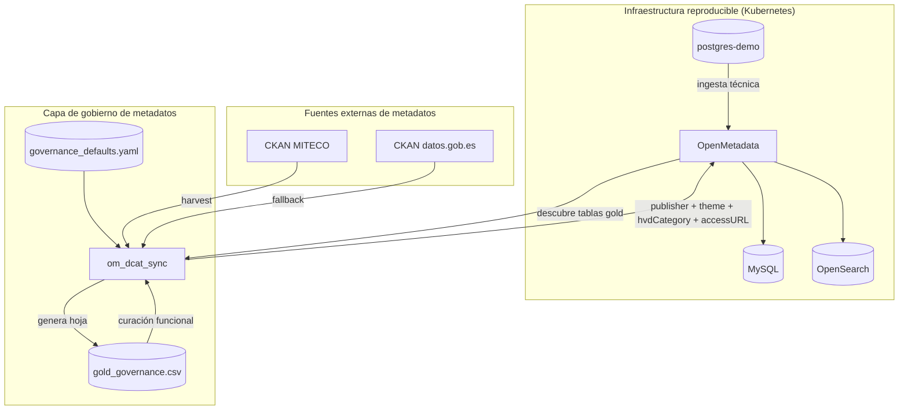
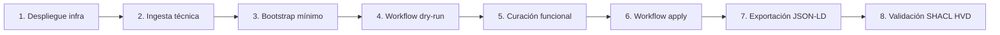
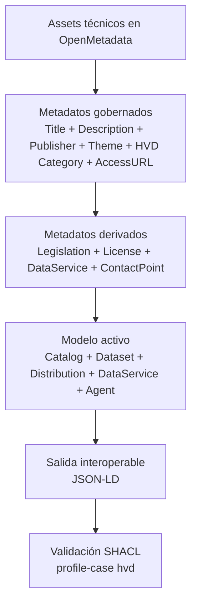
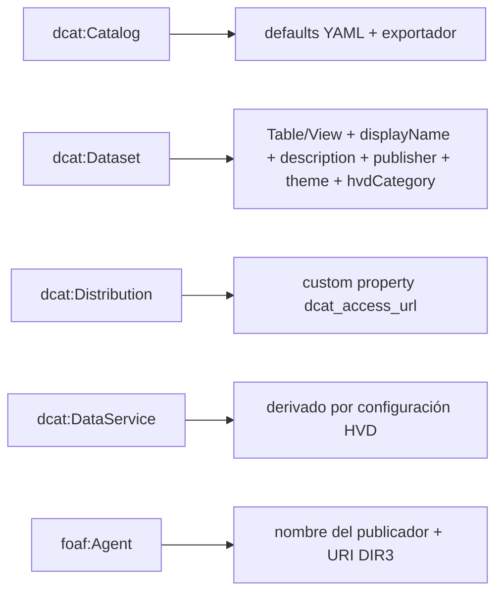
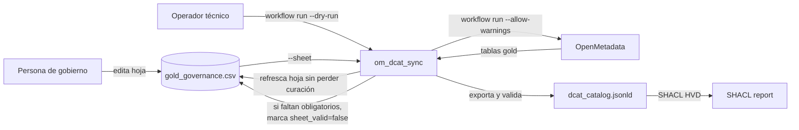
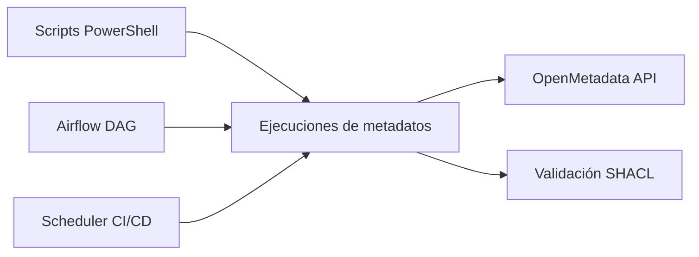

# Diagramas Mermaid

Este documento centraliza diagramas reutilizables para memoria, defensa y portfolio.

## 1) Arquitectura lógica por capas

```mermaid
flowchart TB
  subgraph INFRA["Infraestructura reproducible (Kubernetes)"]
    PG[(postgres-demo)]
    OM[OpenMetadata]
    MY[(MySQL)]
    OS[(OpenSearch)]
  end

  subgraph GOV["Capa de gobierno de metadatos"]
    SYNC[om_dcat_sync]
    SHEET[(gold_governance.csv)]
    CFG[(governance_defaults.yaml)]
  end

  subgraph EXT["Fuentes externas de metadatos"]
    CKAN1[CKAN MITECO]
    CKAN2[CKAN datos.gob.es]
  end

  PG -->|ingesta técnica| OM
  OM --> MY
  OM --> OS
  CFG --> SYNC
  OM -->|descubre tablas gold| SYNC
  SYNC -->|genera hoja| SHEET
  SHEET -->|curación funcional| SYNC
  SYNC -->|publisher + theme + hvdCategory + accessURL| OM
  CKAN1 -->|harvest| SYNC
  CKAN2 -->|fallback| SYNC
```

## 2) Flujo operativo real

```mermaid
flowchart LR
  A[1. Despliegue infra] --> B[2. Ingesta técnica]
  B --> C[3. Bootstrap mínimo]
  C --> D[4. Workflow dry-run]
  D --> E[5. Curación funcional]
  E --> F[6. Workflow apply]
  F --> G[7. Exportación JSON-LD]
  G --> H[8. Validación SHACL HVD]
```

## 3) Pipeline de metadatos

```mermaid
flowchart TB
  TBL[Assets técnicos en OpenMetadata] --> GOV[Metadatos gobernados\nTitle + Description + Publisher + Theme + HVD Category + AccessURL]
  GOV --> DER[Metadatos derivados\nLegislation + License + DataService + ContactPoint]
  DER --> DCAT[Modelo activo\nCatalog + Dataset + Distribution + DataService + Agent]
  DCAT --> OUT[Salida interoperable\nJSON-LD]
  OUT --> SHACL[Validación SHACL\nprofile-case hvd]
```

## 4) Mapeo activo conforme

```mermaid
flowchart LR
  C1[dcat:Catalog] --> O1[defaults YAML + exportador]
  C2[dcat:Dataset] --> O2[Table/View + displayName + description + publisher + theme + hvdCategory]
  C3[dcat:Distribution] --> O3[custom property dcat_access_url]
  C4[dcat:DataService] --> O4[derivado por configuración HVD]
  C5[foaf:Agent] --> O5[nombre del publicador + URI DIR3]
```

## 5) Actor funcional y sistema

```mermaid
flowchart LR
  A[Persona de gobierno] -->|edita hoja| S[(gold_governance.csv)]
  T[Operador técnico] -->|workflow run --dry-run| C[om_dcat_sync]
  OM[OpenMetadata] -->|tablas gold| C
  C -->|refresca hoja sin perder curación| S
  S -->|--sheet| C
  C -->|si faltan obligatorios,\nmarca sheet_valid=false| S
  C -->|workflow run --allow-warnings| OM
  C -->|exporta y valida| J[dcat_catalog.jsonld]
  J -->|SHACL HVD| R[SHACL report]
```

## 6) Opciones de orquestación

```mermaid
flowchart LR
  M1[Scripts PowerShell] --> EJEC[Ejecuciones de metadatos]
  M2[Airflow DAG] --> EJEC
  M3[Scheduler CI/CD] --> EJEC
  EJEC --> OM[OpenMetadata API]
  EJEC --> VAL[Validación SHACL]
```

La PoC actual usa scripts PowerShell. Airflow o CI/CD quedan como evolución natural.
