# Diagramas Mermaid

Este documento centraliza diagramas reutilizables para memoria, defensa y portfolio.

## 1) Arquitectura lógica por capas

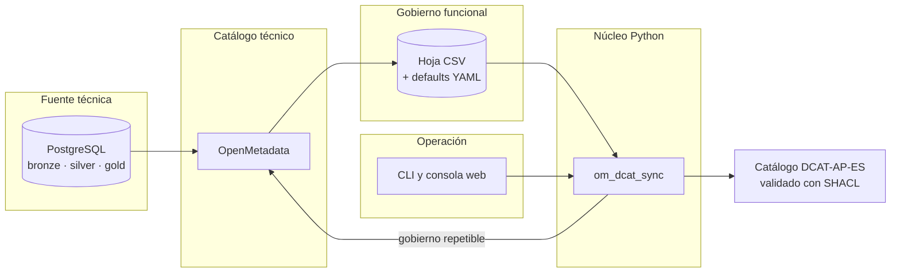
```mermaid
flowchart LR
  subgraph FUENTE["Fuente técnica"]
    PG[(PostgreSQL<br/>bronze · silver · gold)]
  end
  subgraph TEC["Catálogo técnico"]
    OM[OpenMetadata]
  end
  subgraph GOB["Gobierno funcional"]
    SHEET[(Hoja CSV<br/>+ defaults YAML)]
  end
  subgraph NUCLEO["Núcleo Python"]
    CORE[om_dcat_sync]
  end
  subgraph OPER["Operación"]
    UI[CLI y consola web]
  end
  OUT[Catálogo DCAT-AP-ES<br/>validado con SHACL]

  PG --> OM --> SHEET --> CORE --> OUT
  CORE -->|gobierno repetible| OM
  UI --> CORE
```

## 2) Flujo operativo real

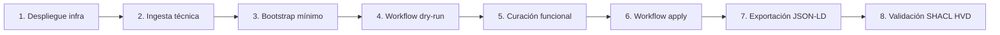
```mermaid
flowchart LR
  A[1. Despliegue infra] --> B[2. Ingesta técnica]
  B --> C[3. Bootstrap mínimo]
  C --> D[4. Workflow dry-run]
  D --> E[5. Curación funcional]
  E --> F[6. Workflow apply]
  F --> G[7. Exportación JSON-LD]
  G --> H[8. Validación SHACL HVD]
```

## 3) Pipeline de metadatos

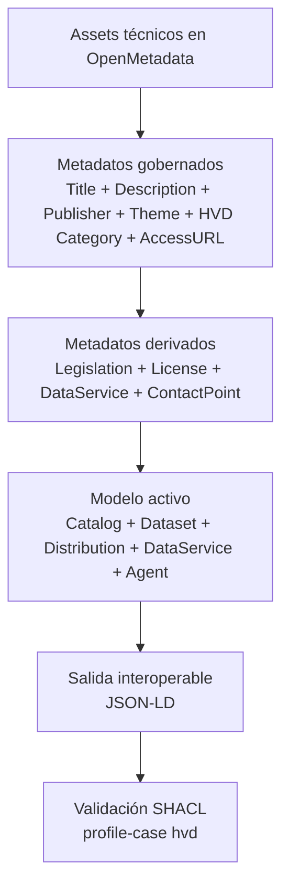
```mermaid
flowchart TB
  TBL[Assets técnicos en OpenMetadata] --> GOV[Metadatos gobernados<br/>Title + Description + Publisher + Theme + HVD Category + AccessURL]
  GOV --> DER[Metadatos derivados<br/>Legislation + License + DataService + ContactPoint]
  DER --> DCAT[Modelo activo<br/>Catalog + Dataset + Distribution + DataService + Agent]
  DCAT --> OUT[Salida interoperable<br/>JSON-LD]
  OUT --> SHACL[Validación SHACL<br/>profile-case hvd]
```

## 4) Mapeo activo conforme

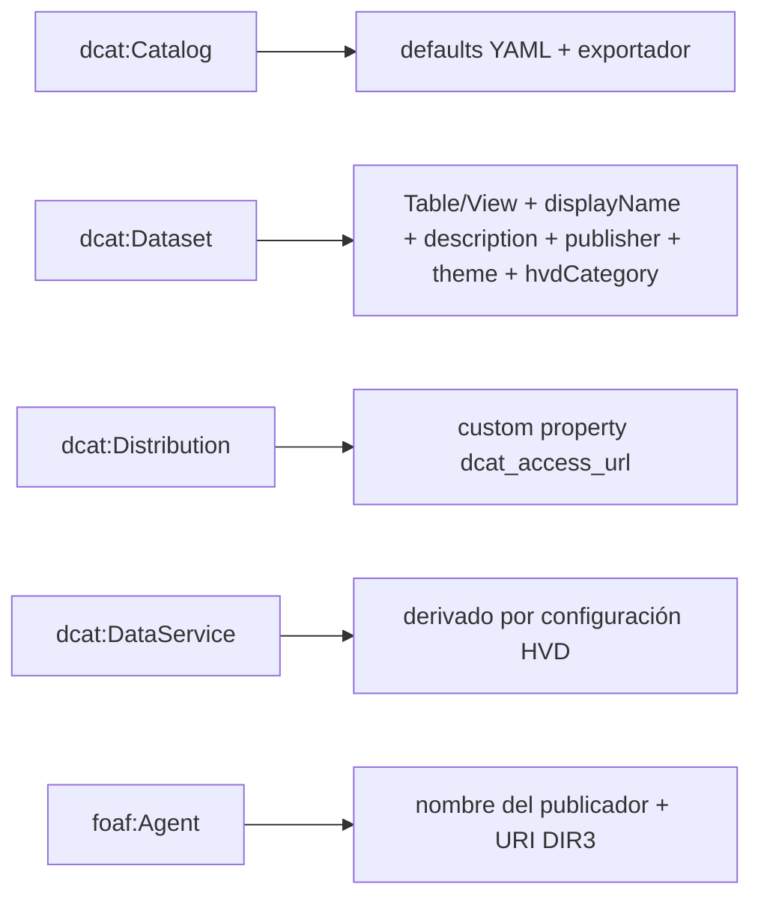
```mermaid
flowchart LR
  C1[dcat:Catalog] --> O1[defaults YAML + exportador]
  C2[dcat:Dataset] --> O2[Table/View + displayName + description + publisher + theme + hvdCategory]
  C3[dcat:Distribution] --> O3[custom property dcat_access_url]
  C4[dcat:DataService] --> O4[derivado por configuración HVD]
  C5[foaf:Agent] --> O5[nombre del publicador + URI DIR3]
```

## 5) Actor funcional y sistema

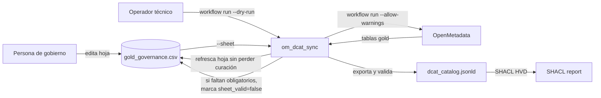
```mermaid
flowchart LR
  A[Persona de gobierno] -->|edita hoja| S[(gold_governance.csv)]
  T[Operador técnico] -->|workflow run --dry-run| C[om_dcat_sync]
  OM[OpenMetadata] -->|tablas gold| C
  C -->|refresca hoja sin perder curación| S
  S -->|--sheet| C
  C -->|si faltan obligatorios,<br/>marca sheet_valid=false| S
  C -->|workflow run --allow-warnings| OM
  C -->|exporta y valida| J[dcat_catalog.jsonld]
  J -->|SHACL HVD| R[SHACL report]
```

## 6) Opciones de orquestación

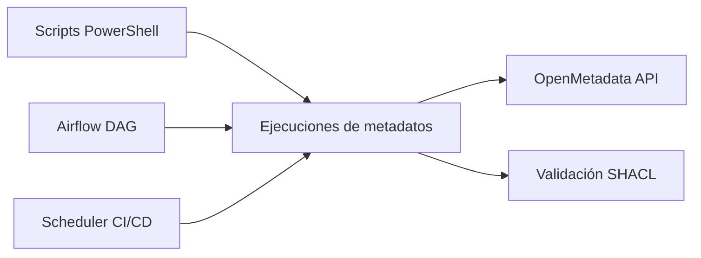
```mermaid
flowchart LR
  M1[Scripts PowerShell] --> EJEC[Ejecuciones de metadatos]
  M2[Airflow DAG] --> EJEC
  M3[Scheduler CI/CD] --> EJEC
  EJEC --> OM[OpenMetadata API]
  EJEC --> VAL[Validación SHACL]
```

La plataforma actual usa scripts PowerShell y app web. Airflow o CI/CD quedan como evolución natural.

## 7) App web operativa y núcleo Python

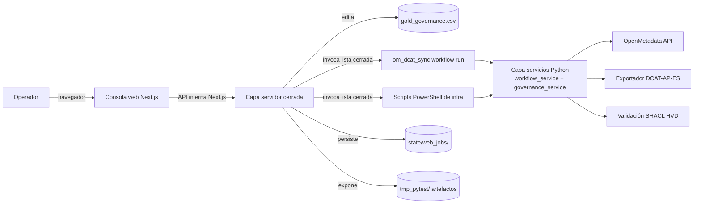
```mermaid
flowchart LR
  USR[Operador] -->|navegador| UI[Consola web Next.js]
  UI -->|API interna Next.js| API[Capa servidor cerrada]
  API -->|edita| CSV[(gold_governance.csv)]
  API -->|invoca lista cerrada| CLI[om_dcat_sync workflow run]
  API -->|invoca lista cerrada| SCR[Scripts PowerShell de infra]
  CLI --> CORE[Capa servicios Python<br/>workflow_service + governance_service]
  SCR --> CORE
  CORE --> OM[OpenMetadata API]
  CORE --> EXP[Exportador DCAT-AP-ES]
  CORE --> SHACL[Validación SHACL HVD]
  API -->|persiste| JOBS[(state/web_jobs/)]
  API -->|expone| ART[(tmp_pytest/ artefactos)]
```

La UI nunca duplica reglas: invoca el mismo núcleo Python que el CLI y los scripts.

## 8) Despliegue Kubernetes reproducible

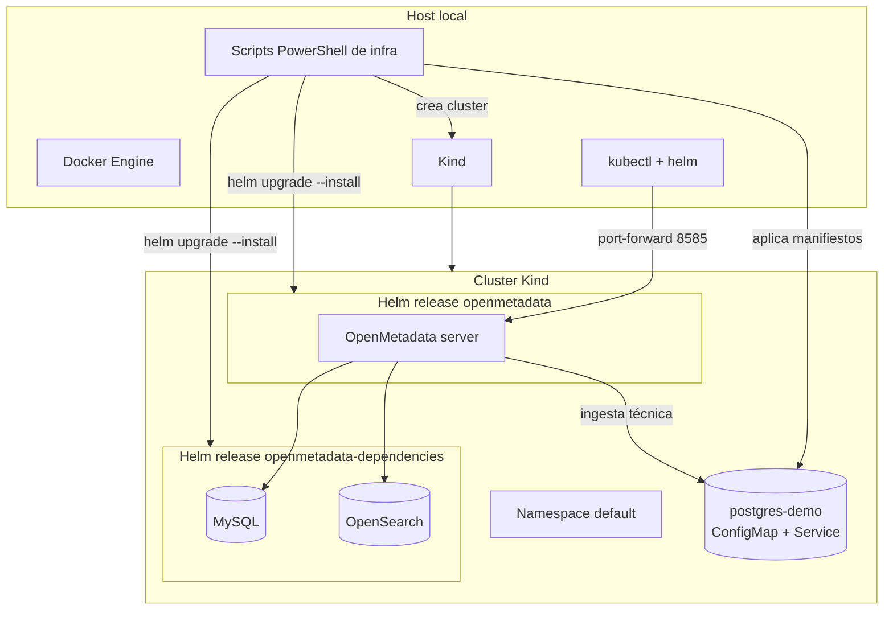
```mermaid
flowchart TB
  subgraph LOCAL["Host local"]
    DOCKER[Docker Engine]
    KIND[Kind]
    KCTL[kubectl + helm]
    PSCR[Scripts PowerShell de infra]
  end
  subgraph CLUSTER["Cluster Kind"]
    NS[Namespace default]
    subgraph DEPS["Helm release openmetadata-dependencies"]
      MY[(MySQL)]
      OS[(OpenSearch)]
    end
    subgraph APP["Helm release openmetadata"]
      OM[OpenMetadata server]
    end
    PG[(postgres-demo<br/>ConfigMap + Service)]
  end
  PSCR -->|crea cluster| KIND
  KIND --> CLUSTER
  PSCR -->|helm upgrade --install| DEPS
  PSCR -->|helm upgrade --install| APP
  PSCR -->|aplica manifiestos| PG
  KCTL -->|port-forward 8585| OM
  OM --> MY
  OM --> OS
  OM -->|ingesta técnica| PG
```

Los `values` Helm canónicos están en `k8s/openmetadata.values.yaml` y `k8s/openmetadata-dependencies.values.yaml`. El SQL fuente reproducible se aplica desde `sql/opendata_demo_init.sql`.

## 9) Artefactos y evidencias reproducibles

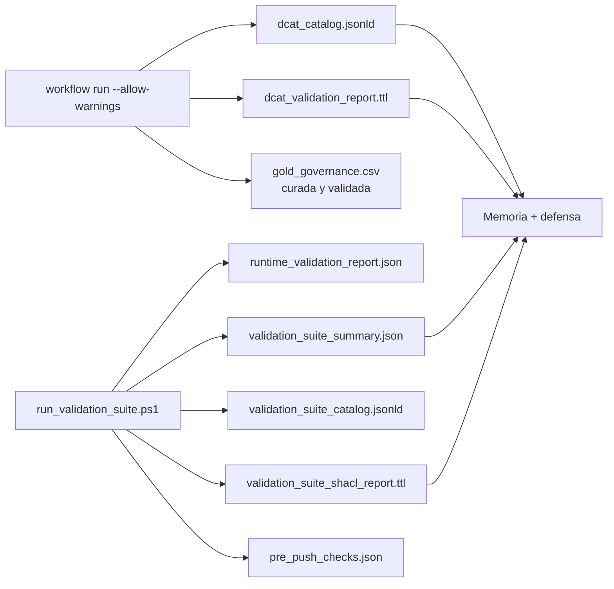
```mermaid
flowchart LR
  WF[workflow run --allow-warnings] --> J1[dcat_catalog.jsonld]
  WF --> J2[dcat_validation_report.ttl]
  WF --> J3[gold_governance.csv<br/>curada y validada]
  SUITE[run_validation_suite.ps1] --> S1[runtime_validation_report.json]
  SUITE --> S2[validation_suite_summary.json]
  SUITE --> S3[validation_suite_catalog.jsonld]
  SUITE --> S4[validation_suite_shacl_report.ttl]
  SUITE --> S5[pre_push_checks.json]
  J1 --> MEM[Memoria + defensa]
  J2 --> MEM
  S2 --> MEM
  S4 --> MEM
```

Todos los artefactos viven en `tmp_pytest/`, ignorado por Git pero regenerable de forma determinista desde el repositorio limpio.

## 10) Arquitectura lógica por capas y responsabilidades

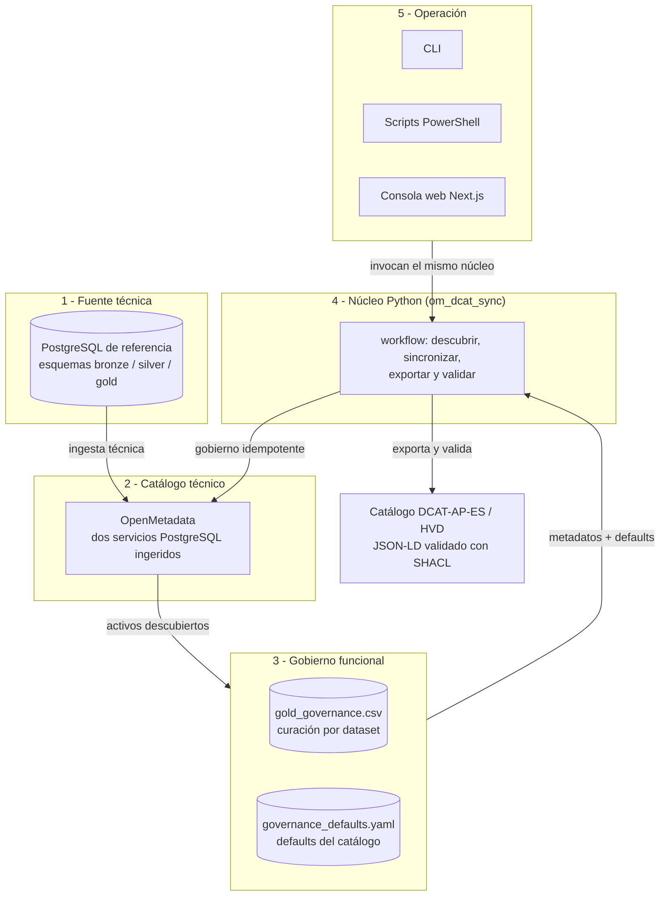
```mermaid
flowchart TB
  subgraph L1["1 - Fuente técnica"]
    PG[(PostgreSQL de referencia<br/>esquemas bronze / silver / gold)]
  end
  subgraph L2["2 - Catálogo técnico"]
    OM[OpenMetadata<br/>dos servicios PostgreSQL ingeridos]
  end
  subgraph L3["3 - Gobierno funcional"]
    SHEET[(gold_governance.csv<br/>curación por dataset)]
    CFG[(governance_defaults.yaml<br/>defaults del catálogo)]
  end
  subgraph L4["4 - Núcleo Python (om_dcat_sync)"]
    WF[workflow: descubrir, sincronizar,<br/>exportar y validar]
  end
  subgraph L5["5 - Operación"]
    CLI[CLI]
    SCR[Scripts PowerShell]
    WEB[Consola web Next.js]
  end
  OUT[Catálogo DCAT-AP-ES / HVD<br/>JSON-LD validado con SHACL]

  PG -->|ingesta técnica| OM
  OM -->|activos descubiertos| L3
  L3 -->|metadatos + defaults| WF
  WF -->|gobierno idempotente| OM
  WF -->|exporta y valida| OUT
  L5 -->|invocan el mismo núcleo| WF
```

## 11) Arquitectura física de despliegue

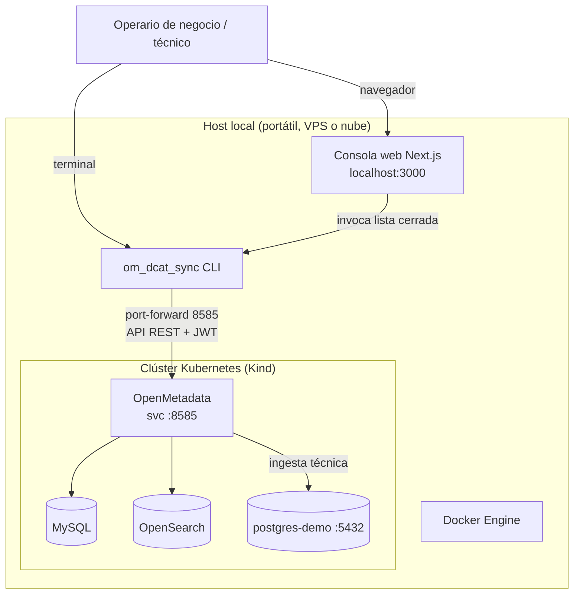
```mermaid
flowchart TB
  OPER[Operario de negocio / técnico]
  subgraph HOST["Host local (portátil, VPS o nube)"]
    DOCKER[Docker Engine]
    WEB[Consola web Next.js<br/>localhost:3000]
    CLI[om_dcat_sync CLI]
    subgraph KIND["Clúster Kubernetes (Kind)"]
      OM[OpenMetadata<br/>svc :8585]
      MY[(MySQL)]
      OSE[(OpenSearch)]
      PG[(postgres-demo :5432)]
    end
  end
  OPER -->|navegador| WEB
  OPER -->|terminal| CLI
  WEB -->|invoca lista cerrada| CLI
  CLI -->|port-forward 8585<br/>API REST + JWT| OM
  OM --> MY
  OM --> OSE
  OM -->|ingesta técnica| PG
```

Los diagramas 10 y 11 se reutilizan en el capítulo de arquitectura de la memoria como vista lógica por capas y vista física de despliegue, respectivamente.

## 12) Visión funcional de la solución

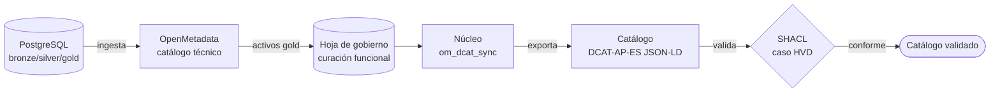
```mermaid
flowchart LR
  PG[(PostgreSQL<br/>bronze/silver/gold)] -->|ingesta| OM[OpenMetadata<br/>catálogo técnico]
  OM -->|activos gold| SHEET[(Hoja de gobierno<br/>curación funcional)]
  SHEET --> CORE[Núcleo<br/>om_dcat_sync]
  CORE -->|exporta| CAT[Catálogo<br/>DCAT-AP-ES JSON-LD]
  CAT -->|valida| SHACL{SHACL<br/>caso HVD}
  SHACL -->|conforme| OK([Catálogo validado])
```

El diagrama 12 ofrece la visión funcional de conjunto que precede a la vista lógica por capas en la introducción de la memoria (figura `fig_vision_funcional_solucion.png`).

## 13) Diagrama de secuencia: operación del responsable del catálogo

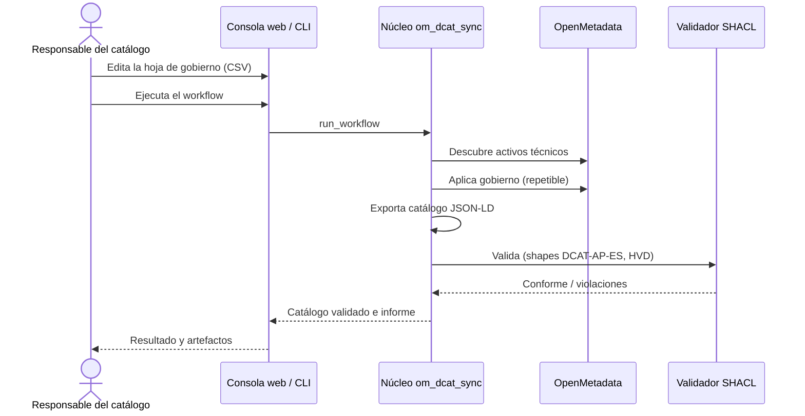
```mermaid
sequenceDiagram
    actor R as Responsable del catálogo
    participant W as Consola web / CLI
    participant N as Núcleo om_dcat_sync
    participant OM as OpenMetadata
    participant SH as Validador SHACL
    R->>W: Edita la hoja de gobierno (CSV)
    R->>W: Ejecuta el workflow
    W->>N: run_workflow
    N->>OM: Descubre activos técnicos
    N->>OM: Aplica gobierno (repetible)
    N->>N: Exporta catálogo JSON-LD
    N->>SH: Valida (shapes DCAT-AP-ES, HVD)
    SH-->>N: Conforme / violaciones
    N-->>W: Catálogo validado e informe
    W-->>R: Resultado y artefactos
```

El diagrama 13 (figura `fig_secuencia_operacion.png`) muestra la interacción del actor principal con la plataforma de extremo a extremo, para la sección de actores del sistema.
