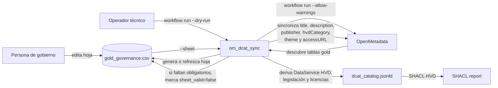

# Gobierno funcional de datasets `gold`

Este documento define el flujo recomendado para mantener los metadatos de gobierno de la plataforma sin convertir la ETL en un catálogo estático codificado a mano.

La plataforma trata los servicios conectados a OpenMetadata como origen de activos técnicos gobernables. Para el caso de uso de validación, el catálogo publicable se fija como catálogo UCLM: las tablas `gold` se curan en esta hoja y los datos globales del organismo, licencias, contacto y legislación se derivan desde `tfm_ingestor/config/governance_defaults.yaml`.

## Objetivo

La plataforma solo gobierna los datasets publicables de la capa `gold` del PostgreSQL de referencia definido en `sql/opendata_demo_init.sql`.

El resultado funcional es un catálogo RDF serializado en JSON-LD conforme a `DCAT-AP-ES` y validado con SHACL. El catálogo queda preparado para interoperabilidad con `datos.gob.es` y catálogos europeos compatibles, sin publicar automáticamente en un portal externo en esta iteración.

En el estado actual del repositorio eso significa:

- `gold.movilidad_resumen_municipio`
- `gold.agenda_cultural_publica`

`bronze` y `silver` se ingieren en OpenMetadata como metadatos técnicos, pero no entran en el catálogo publicable.

## Qué resuelve esta hoja funcional

Si el enriquecimiento se define solo con reglas fijas en código o YAML, escalar a muchos datasets obliga a modificar la ETL cada vez que cambian títulos, descripciones o decisiones de publicación.

La solución adoptada es una hoja CSV editable por una persona no técnica:

- ruta canónica: `tfm_ingestor/config/gold_governance.csv`
- formato: CSV con `;` y codificación UTF-8 con BOM
- generación automática dentro del workflow: `python -m om_dcat_sync workflow run --dry-run`
- fuente canónica de sincronización: el workflow aplica en OpenMetadata únicamente lo que figure en esta hoja para cada dataset `gold`
- uso de `mapping_rules.yaml`: solo para acotar el ámbito técnico y sugerir valores iniciales al refrescar la hoja

## Qué edita la persona no técnica

Las columnas funcionales de la hoja son:

- `publicar`
- `titulo_dataset`
- `descripcion_dataset`
- `publicador`
- `tematica_dcat`
- `categoria_hvd`
- `access_url_distribucion`

Las columnas técnicas no deben tocarse:

- `schema_name`
- `table_name`
- `table_fqn`

Valores admitidos desde la app web:

- `tematica_dcat`: los sectores NTI-RISP definidos en las SHACL locales congeladas, con alias de hoja en formato `snake_case`: `ciencia_tecnologia`, `comercio`, `cultura_ocio`, `demografia`, `deporte`, `economia`, `educacion`, `empleo`, `energia`, `hacienda`, `industria`, `legislacion_justicia`, `medio_ambiente`, `medio_rural_pesca`, `salud`, `sector_publico`, `seguridad`, `sociedad_bienestar`, `transporte`, `turismo`, `urbanismo_infraestructuras` y `vivienda`.
- `categoria_hvd`: las seis categorías superiores del vocabulario europeo HVD: `geoespacial`, `observacion_de_la_tierra_y_medio_ambiente`, `meteorologia`, `estadisticas`, `sociedades_y_propiedad_de_sociedades` y `movilidad`.

La app web usa listas desplegables para estos dos campos, precisamente para evitar valores fuera de los vocabularios controlados. A nivel Python también se admite una URI HVD completa si en el futuro la hoja necesita más granularidad fuera del caso de uso cerrado de validación.

La ayuda de la web recomienda cómo rellenar cada campo y el botón `Autorrellenar vacíos` propone valores por defecto validables para las tablas concretas de la plataforma sin sobrescribir datos ya escritos.

## Qué significa `publicar`

`publicar` es la decisión funcional de incluir o excluir una tabla `gold` del catálogo abierto exportado en la plataforma.

- `publicar=si`: la tabla se trata como `dcat:Dataset` publicable. Debe tener título, descripción, publicador, temática DCAT, categoría HVD y URL de acceso. El workflow la sincroniza con OpenMetadata y el exportador la incluye en el JSON-LD.
- `publicar=no`: la fila puede conservarse como referencia operativa, pero no representa un dataset publicable de la plataforma. No se le exigen los obligatorios funcionales de publicación.

Este campo no es una propiedad DCAT-AP-ES. Es un control operativo local para separar assets técnicos ingeridos de datasets que se publican en el catálogo.

## Cobertura de obligatorios HVD

La hoja `gold_governance.csv` no contiene todos los obligatorios de `DCAT-AP-ES` con HVD. Contiene únicamente los campos funcionales que varían por dataset y que una persona responsable del catálogo debe poder curar sin tocar código:

| Columna | Papel en DCAT-AP-ES / HVD |
| --- | --- |
| `titulo_dataset` | `dct:title` del `dcat:Dataset` |
| `descripcion_dataset` | `dct:description` del `dcat:Dataset` |
| `publicador` | nombre funcional del publicador usado en `dct:publisher` |
| `tematica_dcat` | `dcat:theme` del `dcat:Dataset` y del `dcat:DataService` |
| `categoria_hvd` | `dcatap:hvdCategory` |
| `access_url_distribucion` | `dcat:accessURL` de la `dcat:Distribution` |

El resto de obligatorios se cubre por configuración global y derivación automática:

- `dcat:Catalog`: `title`, `description`, `publisher`, `homepage`, `themeTaxonomy`, `issued`, `modified`, `language` y `license` salen de `tfm_ingestor/config/governance_defaults.yaml`.
- `dcat:Distribution`: licencia HVD y legislación aplicable salen de `hvd_defaults`.
- `dcat:DataService`: `title`, `endpointURL`, `endpointDescription`, `publisher`, `theme`, `hvdCategory`, `applicableLegislation`, `contactPoint`, `foaf:page`, `servesDataset`, `license` y `accessRights` se derivan en `tfm_ingestor/src/tfm_ingestor/dcat_export.py`.

En el perfil actual, `governance_defaults.yaml` fija UCLM como organismo publicador del catálogo y de los servicios derivados. La hoja permite cambiar el nombre funcional del publicador por dataset, pero el URI institucional del publicador se mantiene centralizado para evitar inconsistencias.

Por tanto, la afirmación defendible es: **la hoja cubre los obligatorios funcionales por dataset; el sistema completo, hoja más configuración global más exportador, cubre el perfil HVD validado en la plataforma**.

## Qué gobierna realmente la plataforma

En OpenMetadata se gobiernan solo estos campos activos:

- `displayName`
- `description`
- custom property `dcat_publisher_name`
- custom property `dcat_hvd_category`
- custom property `dcat_access_url`
- tags `dcat_theme.*`

## Qué deriva el sistema automáticamente

El resto del perfil HVD se deriva por configuración del sistema y no requiere edición manual por dataset:

- `dcatap:applicableLegislation`
- `dct:license` de `Distribution`
- `dct:license` y `dct:accessRights` de `DataService`
- `dcat:endpointURL`
- `dcat:endpointDescription`
- `foaf:page`
- `dcat:contactPoint`
- `dcat:servesDataset`

## Flujo operativo

### Paso 1. Descubrimiento técnico y preparación del workflow

```powershell
python -m om_dcat_sync workflow run --dry-run
```

Resultado:

- se listan las tablas `gold` presentes en OpenMetadata;
- se genera o refresca `tfm_ingestor/config/gold_governance.csv`;
- las filas ya curadas no se pisan;
- las sugerencias automáticas solo pre-rellenan la hoja y no sustituyen su contenido como fuente de verdad.
- si faltan obligatorios funcionales, el workflow responde con `sheet_valid=false` y el motivo concreto.

### Paso 2. Curación funcional

La persona de gobierno decide:

- si el dataset se publica o no;
- el título público;
- la descripción pública;
- el nombre del publicador;
- la temática;
- la categoría HVD usada en la plataforma;
- la URL de acceso de la distribución.

### Paso 3. Validación técnica sin cambios

```powershell
python -m om_dcat_sync workflow run --dry-run
```

### Paso 4. Aplicación, exportación y validación

```powershell
python -m om_dcat_sync workflow run --allow-warnings
```

## Diagrama del flujo funcional



## Justificación

Esta solución es preferible a un mapeo estático por dataset porque:

- separa la responsabilidad técnica de la funcional;
- evita tocar código por cada alta o cambio editorial;
- mantiene la automatización idempotente;
- permite que la curación la haga una persona no técnica desde un único punto controlado;
- deja preparado el sistema para que la app web y cualquier futura API escriban el mismo contrato lógico que hoy representa la hoja CSV.
