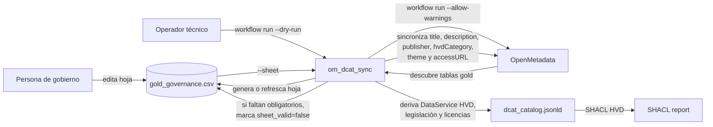

# Gobierno funcional de datasets `gold`

Este documento define el flujo recomendado para mantener los metadatos de gobierno de la PoC sin convertir la ETL en un catálogo estático codificado a mano.

## Objetivo

La PoC solo gobierna los datasets publicables de la capa `gold` del demo PostgreSQL definido en `sql/opendata_demo_init.sql`.

En el estado actual del repositorio eso significa:

- `gold.movilidad_resumen_municipio`
- `gold.agenda_cultural_publica`

`bronze` y `silver` se ingieren en OpenMetadata como metadatos técnicos, pero no entran en el catálogo publicable.

## Qué resuelve esta hoja funcional

Si el enriquecimiento se define solo con reglas fijas en código o YAML, escalar a muchos datasets obliga a modificar la ETL cada vez que cambian títulos, descripciones o decisiones de publicación.

La solución adoptada es una hoja CSV editable por una persona no técnica:

- ruta canónica: `tfm_ingestor/config/gold_governance.csv`
- formato: CSV con `;` y codificación UTF-8 con BOM
- generación automática dentro del workflow: `python -m om_dcat_sync workflow run --dry-run`

## Qué edita la persona no técnica

Las columnas funcionales de la hoja son:

- `publicar`
- `titulo_dataset`
- `descripcion_dataset`
- `publicador`
- `tematica_dcat`
- `categoria_hvd`
- `access_url_distribucion`

Las columnas técnicas no deben tocarse:

- `schema_name`
- `table_name`
- `table_fqn`

Valores admitidos en la PoC demo:

- `tematica_dcat`: `transporte`, `cultura_ocio`
- `categoria_hvd`: `movilidad`, `estadisticas`

También se admite una URI HVD completa si en el futuro la interfaz o la hoja necesitan más granularidad.

## Qué gobierna realmente la PoC

En OpenMetadata se gobiernan solo estos campos activos:

- `displayName`
- `description`
- custom property `dcat_publisher_name`
- custom property `dcat_hvd_category`
- custom property `dcat_access_url`
- tags `dcat_theme.*`

## Qué deriva el sistema automáticamente

El resto del perfil HVD se deriva por configuración del sistema y no requiere edición manual por dataset:

- `dcatap:applicableLegislation`
- `dct:license` de `Distribution`
- `dct:license` y `dct:accessRights` de `DataService`
- `dcat:endpointURL`
- `dcat:endpointDescription`
- `foaf:page`
- `dcat:contactPoint`
- `dcat:servesDataset`

## Flujo operativo

### Paso 1. Descubrimiento técnico y preparación del workflow

```powershell
python -m om_dcat_sync workflow run --dry-run
```

Resultado:

- se listan las tablas `gold` presentes en OpenMetadata;
- se genera o refresca `tfm_ingestor/config/gold_governance.csv`;
- las filas ya curadas no se pisan.
- si faltan obligatorios funcionales, el workflow responde con `sheet_valid=false` y el motivo concreto.

### Paso 2. Curación funcional

La persona de gobierno decide:

- si el dataset se publica o no;
- el título público;
- la descripción pública;
- el nombre del publicador;
- la temática;
- la categoría HVD usada en la PoC;
- la URL de acceso de la distribución.

### Paso 3. Validación técnica sin cambios

```powershell
python -m om_dcat_sync workflow run --dry-run
```

### Paso 4. Aplicación, exportación y validación

```powershell
python -m om_dcat_sync workflow run --allow-warnings
```

## Diagrama del flujo funcional



## Justificación

Esta solución es preferible a un mapeo estático por dataset porque:

- separa la responsabilidad técnica de la funcional;
- evita tocar código por cada alta o cambio editorial;
- mantiene la automatización idempotente;
- permite que la curación la haga una persona no técnica desde un único punto controlado;
- deja preparado el sistema para una futura UI que escriba el mismo contrato lógico que hoy representa la hoja CSV.
