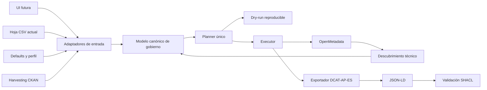

# Refactor de orquestación operativa

Objetivo: preparar la PoC para que el flujo pueda ejecutarse de forma automática por CLI o ETL hoy, y por una futura UI mañana, sin duplicar lógica ni multiplicar configuraciones manuales.

## Problema que se quería resolver

El sistema ya funcionaba, pero la operación estaba demasiado repartida:

- varios scripts PowerShell;
- varios comandos del CLI con distinto orden de ejecución;
- varios ficheros de configuración y entrada (`YAML`, `CSV`, variables de entorno);
- lógica de orquestación mezclada en `main.py`;
- dependencia implícita de que el operador conociera el orden correcto.

Eso era suficiente para una PoC temprana, pero no para:

- automatizar desde ETL o CI;
- preparar una futura UI;
- explicar el flujo a actores no técnicos;
- mantener documentación y código alineados.

## Decisión de arquitectura

El sistema pivota ahora sobre un modelo interno canónico y una capa de servicios reutilizable.

La interfaz de entrada puede cambiar:

- hoy: `CSV`, `YAML`, CLI;
- mañana: UI o API;
- más adelante: integración con otro sistema de gobierno.

Pero el núcleo de reglas y el orden del flujo deben seguir siendo los mismos.

## Principios del refactor

1. Una sola lógica de negocio para todos los canales.
2. Un único orden canónico del flujo.
3. Separación entre descubrimiento técnico, entrada funcional, planificación, aplicación, exportación y validación.
4. Las interfaces no conocen reglas internas de mapeo.
5. Toda ejecución puede hacerse en `dry-run`.
6. Toda ejecución puede serializar un plan reproducible.

## Estado actual implantado

El refactor ya está materializado en el repositorio.

Piezas principales:

- `tfm_ingestor/src/tfm_ingestor/governance_model.py`
  - contrato canónico de intención de gobierno y cambios planificados;
- `tfm_ingestor/src/tfm_ingestor/governance_service.py`
  - descubrimiento, construcción de intención, planificación y aplicación;
- `tfm_ingestor/src/tfm_ingestor/workflow_service.py`
  - orquestador canónico del flujo completo;
- `tfm_ingestor/src/tfm_ingestor/operational_profile.py`
  - carga del perfil operativo principal;
- `tfm_ingestor/config/operational_profile.yaml`
  - punto de configuración operativo para el workflow;
- `tfm_ingestor/src/tfm_ingestor/main.py`
  - CLI fino que delega en la capa de servicios.

## Flujo canónico actual

El punto de entrada principal pasa a ser:

```powershell
python -m om_dcat_sync workflow run --dry-run
```

Orden implícito del workflow:

1. descubrir activos en OpenMetadata;
2. refrescar la hoja funcional si procede;
3. cargar y validar la entrada funcional;
4. normalizar la intención de gobierno;
5. construir el plan reproducible;
6. aplicar cambios si no es `dry-run`;
7. exportar DCAT-AP-ES;
8. validar SHACL.

Aplicación completa:

```powershell
python -m om_dcat_sync workflow run --allow-warnings
```

## Comportamiento del primer arranque

El workflow se ha hecho tolerante al caso normal de una PoC donde la hoja todavía no está completa.

Si después de refrescar `gold_governance.csv` faltan obligatorios editoriales, el comando en `dry-run`:

- no intenta aplicar cambios;
- no falla con una excepción opaca;
- devuelve `sheet_valid=false`;
- informa del campo que falta en `sheet_validation_error`.

Eso permite usar el mismo comando como:

- preparación técnica de la hoja;
- comprobación de estado;
- validación previa antes de aplicar.

## Arquitectura objetivo



## Perfil operativo único

Para reducir dispersión, el workflow usa un perfil principal:

- fichero: `tfm_ingestor/config/operational_profile.yaml`;
- propósito: concentrar rutas base y comportamiento del workflow;
- alcance: no sustituye `YAML` o `CSV`, pero sí reduce los flags que el operador debe recordar.

El operador habitual ya no necesita pensar en:

- dónde están `defaults`, `rules` y `sheet`;
- qué caso SHACL usar;
- dónde escribir por defecto informe y exportación.

Solo necesita ejecutar el workflow canónico y, cuando proceda, editar la hoja funcional.

## Decisión para la futura interfaz

Framework recomendado: `Next.js + React + TypeScript`.

Motivos:

- es la opción más conocida y extendida para interfaces web React;
- tiene una estructura muy convencional, favorable para desarrollo asistido por agentes;
- permite empezar con una interfaz sencilla y crecer después sin rehacer la base;
- soporta bien despliegue en servidor, SPA o exportación estática;
- encaja con la idea de una UI que no reimplementa reglas, sino que usa el mismo núcleo canónico del sistema.

Condición de arquitectura:

- la UI futura no debe hablar con OpenMetadata directamente;
- la UI debe consumir una capa fina propia que invoque el mismo workflow o los mismos servicios canónicos;
- las reglas de gobierno deben seguir viviendo en Python, no duplicadas en JavaScript.

Alternativa aceptable si se quisiera un frontend mínimo y totalmente desacoplado:

- `React + Vite + TypeScript`.

No es la opción elegida porque el objetivo aquí no es solo una demo visual ligera, sino preparar una interfaz futura mantenible y suficientemente estándar para seguir evolucionando con Codex.

## Scripts finos, no inteligentes

Los scripts PowerShell han quedado rebajados a envoltorios operativos:

- levantar infra;
- hacer `port-forward`;
- obtener token;
- invocar `om_dcat_sync workflow run`.

La inteligencia del flujo ya no vive en PowerShell.

## Qué no hay que hacer ahora

- no construir todavía la UI;
- no mover el catálogo funcional a una base de datos sin necesidad;
- no reabrir clases DCAT-AP-ES fuera del alcance activo;
- no duplicar la lógica del workflow en scripts, notebooks o una futura interfaz.

## Criterio de éxito

Este refactor se considera bien encaminado porque ya se cumplen estas condiciones:

- un operador técnico puede ejecutar el flujo principal con un único comando;
- una persona funcional solo necesita editar una única fuente de gobierno;
- el núcleo no depende del formato `CSV`, `YAML` o futura UI;
- los scripts llaman al workflow canónico en lugar de encadenar lógica propia;
- los tests cubren la capa de servicios y el workflow.
